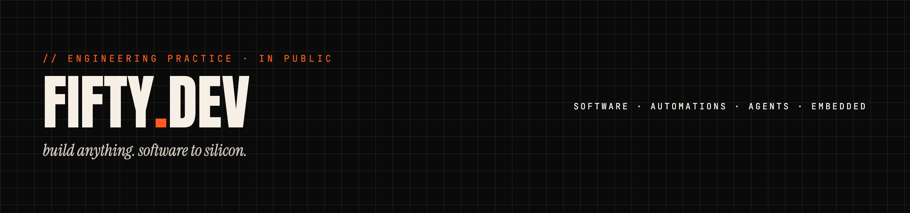

  

# fifty.dev

## About

i build the whole machine: software, automations, agents, embedded. eight years of flutter in production, autonomous agents in daily use, and hardware running in real kitchens. whatever it is, it compiles.

## Philosophy

- build anything. software to silicon.
- four kinds of machine, one operator, one signal.
- a loop that can't end is a loop that doesn't ship.

## Projects

| Project | Status | Role | Notes |
|---|---|---|---|
| [igris-ai](https://github.com/fiftynotai/igris-ai) | LIVE | the engineering os for ai coding agents | plan, tool, verify. they resume your chat, it resumes your work. |
| [fifty-agent-sdk](https://github.com/fiftynotai/fifty-agent-sdk) | LIVE | a reusable react loop for python | pip install fifty-agent-sdk. pluggable llm, state, tools. MIT. |
| [agumon](https://github.com/fiftynotai/agumon) | WIP | personal ai companion | brain, body, plugins. ride-or-die. |
| [fifty_flutter_kit](https://github.com/fiftynotai/fifty_flutter_kit) | LIVE | flutter ecosystem: tokens, theme, ui | eight years of flutter, extracted. |
| [crimson-arena](https://github.com/fiftynotai/crimson-arena) | WIP | ai engineering dashboard for igris | agents that argue. one walks out. |
| [graph_builder](https://github.com/fiftynotai/graph_builder) | LAB | graph and node-based systems in c++ | codebase in, graph out. agents read structure, not vibes. |

## Stack

- software: typescript, python, rust, dart
- flutter: getx, custom mvvm + actions, flame
- agents: igris, agumon, mcp, react loops
- automations: n8n, zapier, custom glue
- embedded: arduino, raspberry pi, seeeduino

## Currently

- multi-agent orchestration
- a wearable agent on the edge
- a home telemetry mesh

## Links

- [fifty.dev](https://fifty.dev)
- [igris-ai](https://github.com/fiftynotai/igris-ai)
- [fifty-agent-sdk](https://github.com/fiftynotai/fifty-agent-sdk)
- [fifty_flutter_kit](https://github.com/fiftynotai/fifty_flutter_kit)
- [agumon](https://github.com/fiftynotai/agumon)
- [crimson-arena](https://github.com/fiftynotai/crimson-arena)
- [graph_builder](https://github.com/fiftynotai/graph_builder)
